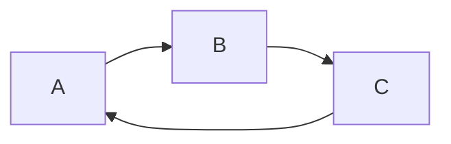
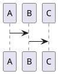
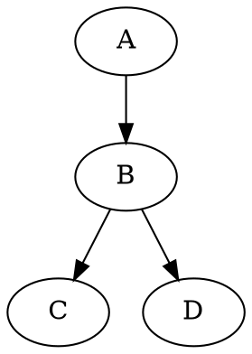

# Markdown语法规则

前言：本网站的所有内容都是基于markdown语法规则，使用VS Code编辑器，并加载了Markdown Preview Enhanced 0.4.1,本文将简介基础的mardown语法规则，和基于扩展包的扩展规则。


##  1. Markdown语法兼容HTML语法

Markdown语法兼容html语法，可以使用html标签设置字体格式，颜色等：

```
# 示例代码
 <div align="center" style="color:red">使用 Markdown 编写文档</div>
```
示例效果：

 <div align="center" style="color:red">使用 Markdown 编写文档</div>

可以借用html语法书写上下标：

```
# 示例代码
H<sub>2</sub>O  CO<sub>2</sub>
爆米<sup>TM</sup>
```

示例效果：

H<sub>2</sub>O  CO<sub>2</sub>
爆米<sup>TM</sup>

## 2. 标题

标题格式为若干个`#` + `titile`，拥有几个`#`符号表示第几级，最多支持6级子标题,注意`#`与标题之间要有空格

```
#代码
# 一级标题
## 二级标题
### 三级标题
#### 四级标题
##### 五级标题
###### 六级标题
####### 不支持7级或更多子标题，反正字数太小也看不清
```
效果：

# 一级标题 {ignore=true} 
## 二级标题 {ignore=true} 
### 三级标题 {ignore=true}
#### 四级标题 {ignore=true}
##### 五级标题 {ignore=true}
###### 六级标题 {ignore=true}
####### 不支持7级或更多子标题，反正字数太小也看不清 {ignore=true}

## 3. 目录

显示目录需要扩展包的支持，本文使用的是Markdown Preview Enhanced 0.4.1，其可根据标题级别生成目录，并可设置显示的级别。

```
# 示例代码：显示本文目录
[TOC]

# 注意： 若某级标题不需要在目录中出现，可在该标题后面添加参数`{ignore=true}`
```
示例效果：

[TOC]

## 4. 段落

每一个自然段前后都要空行，如果只是换行而没有多出中间的空行，编辑器将认为上下两端是同一段文字。

```
#示例代码
段落1
段落2*
```
示例效果：

段落1
段落2*

```
#示例代码
段落1

段落2*
```
示例效果：

段落1

段落2*


## 5. 区块引用 

使用右括号`>`表示区块引用：

```
#示例代码
> 引用1 随便写点东西
>> 引用2
>> 引用2 ## 此两行将显示为同一行，
>>> 引用3.1
>>>
>>> 引用3.2 # 3.1和3.2之间多了一个空行
>>>> 引用4.1 
>>>> \
>>>> 引用4.2 通过添加一行引用符`>`加上转义符`\`，可以达到换行且两行之间没有空行的效果。
>>>>> 引用5 可以一直嵌套引用
>>>>>> 引用6 可以一直嵌套引用
>>>>>>> 引用7 可以一直嵌套引用
>>>>>>>> 引用8 可以一直嵌套引用
```

示例效果：

> 引用1 随便写点东西
>> 引用2.1
>> 引用2.2
>>> 引用3 引用可以嵌套
>>>> 引用4 引用可以嵌套
>>>>> 引用5 引用可以嵌套


## 6. 代码区块

位于文章内段落中间的小段代码，可以用一对反引号表示：`code`。

对于大段的代码区块，则用成对的3个反引号括住，在其中书写代码，或者将所有代码都缩进一个制表符。

```
# 示例代码
# 方法1：用成对的3个反引号括住
    ```python #此行可添加语言标记
    print("Something")
    ```
# 方法2：在代码前面添加一个制表符
        print("nothing") #test前面加一个相当于4个空格的制表符，或直接用四个空格

```

示例效果：

方法1：
```python #此行可添加语言标记
print("Something")
```

方法2：

    print("nothing")

## 7. 列表

Markdown 支持无序列表（用`*`, `+`, `-`作为一行开头）和有序列表（用数字作为行首）。
```
# 示例代码

# 无序列表的三种表示方法，分别是用*，+，-开头并接一个空格，后面是列表内容

无序列表1

* 苹果，西瓜
* 橘子，菠萝
* 香蕉，
    
    草莓

无序列表2：

- 猴子
- 豹子
- 狗子

无序列表3：

+ 电脑  
    > 屏幕
    >
    > 主机
+ 手机
    
        print("mobilephone")
+ 平板

# 有序列表用数字开始，数字后是英文字符.和一个空格，然后是列表内容。注意数字编号不一定要完全按照顺序写，但列表第一项最好还是以1开头

1. 眼睛
1. 鼻子
5. 耳朵 
```

示例效果：

无序列表1
* 苹果，西瓜
* 橘子，菠萝
* 香蕉，
    
    草莓

无序列表2：

- 猴子
- 豹子
- 狗子

无序列表3：

+ 电脑  
    > 屏幕
    >
    > 主机
+ 手机
    
        print("mobilephone")
+ 平板

有序列表：

1. 眼睛
1. 鼻子
5. 耳朵

注意事项：

- 列表内项目可以包括不止一段内容，每个段落都需要首行缩进以表示其是该列表子项目的一部分。

- 列表内可以包含引用和代码块。

## 8. 分割线
有以下几种方式都可以建立分割线：

```
# 示例代码：
* * *
***
*****
- - -
---------------------------------------
```

示例效果：

* * *
***
*****
- - -
---------------------------------------

## 9. 插入网页链接

有两种方式可以插入链接：行内式和参考式。当链接较多时后者更方便。

行内式格式为`[example](links "titile")`。

参考式格式分两部分，第一部分是在要插入链接的位置标记好id`[example][id]`， 该链接将显示成example的名字，接着在全文任意地方(一般是全文最后以注解，脚注或参考文献的方式标出)将该id代表的网址和标题按格式写在后面`[id]: links "titile" `，id可以是字母、数字、空白和标点符号，但不区分大小写。 简短的网址也可以直接用方括号括起来，markdown会将该网址直接转变成一个链接

```
#示例代码：行内式插入链接
[Blog of WUPZ](https://knightwupz.github.io/ 'MY Blog')

# 示例代码：参考式插入链接
[百度][2] 

[2]: https://knightwupz.github.io/ 'MY Blog'

# 示例代码：自动链接
<https://knightwupz.github.io>
<username@126.com>
```

示例效果：

[Blog of WUPZ](https://knightwupz.github.io/ 'MY Blog')

[Blog of WUPZ][2] 

[2]: https://knightwupz.github.io/ 'MY Blog'

<https://knightwupz.github.io>
<username@126.com>

## 10. 插入图片

插入图片与插入链接的格式有些类似，也有两种行内式和参考式两种方式，书写格式分别是在插入链接的格式之前添加一个`!`。

```
行内式格式：


参考式格式：
[picture][id]

[id]: links "titile" 

# 注意：
# 1. links表示图片的存放地址，可以是相对当前文档的路径，也可以是网络上公开的图片网址
# 2. markdown暂时没办法指定图片大小，如有需要可以参考html语法添加标签插入图片

```

## 11. 字体强调

在需要强调的内容前后分别加上一个或两个`*`,可以达到使该段内容变成斜体或加粗的效果。`*`也可换成`_`

```
# 示例代码

*斜体*

_斜体_

**加粗**

__加粗__

***斜体+加粗***

**_斜体+加粗_**

<i>斜体</i>  
            <b>加粗</b>  
            <em>强调</em>  
            <u>下划线</u>   
            <del>删除</del>  
            Z<sup>a</sup>  
            Z<sub>a</sub>  
            <kbd>Ctrl</kbd>

# 以下代码需要扩展包

==背景色==

~~删除~~

```

示例效果：

*斜体*

_斜体_

**加粗**

__加粗_

***斜体加粗***

**_斜体加粗_**

_**斜体加粗**_

___斜体加粗___

<i>斜体</i>  
            <b>加粗</b>  
            <em>强调</em>  
            <u>下划线</u>   
            <del>删除</del>  
            Z<sup>a</sup>  
            Z<sub>a</sub>  
            <kbd>Ctrl</kbd>
            
==背景色==

~~删除~~

## 12. 特殊字符

有些特殊字符需要在前面加入反斜杠来表示，这些字符包括：

```
\   反斜线
`   反引号
*   星号
_   底线
{}  花括号
[]  方括号
()  括弧
#   井字号
+   加号
-   减号
.   英文句点
!   惊叹号
```

## Markdown扩展语法

本部分的语法需要加载扩展包，推荐使用Markdown Preview Enhanced最新版。

### 表格

markdown表格使用`|`作为列与列之间的分隔符，每一行要有相同的`|`个数。

```
# 示例代码

| 表格  | 第一列          | 第二列    |
|:----|:----------------:|----------:| 
| 第一行| 写点什么         | 吧 |
| 第二行| 还是空着     |   好了 |
| 第三行 | 就这样      |   吧 |

# 注意：|:----|:----------------:|----------:| 这一行只能写在第二行，：表示对其方式，写在左边表示左对齐，写在右边表示右对齐，写在两边表示居中对齐
```

| 表格  | 第一列          | 第二列    |
|:----|:----------------:|----------:| 
| 第一行| 写点什么         | 吧 |
| 第二行| 还是空着     |   好了 |
| 第三行 | 就这样      |   吧 |

### 数学公式

Markdown Preview Enhanced 默认使用KaTeX渲染数学表达式，可在设置中更改为MathJax。KaTeX速度更快，但不如MathJax支持的特性多。

行内公式使用 `$...$` 或者 `\(...\)` 分隔符表示，一个大段区块的数学公式用 `$$...$$` 或者 `\[...\]` 表示。分隔符内的数学公式语法参考LaTeX语法。KaTeX所支持的符号和函数可以在[KaTeX Supported Functions](https://katex.org/docs/supported.html)中找到。

```
# 示例代码

$$ x \href{why-equal.html}{=} y^2 + 1 $$

\( x = {-b \pm \sqrt{b^2-4ac} \over 2a} \)

```

示例效果：

$$ x \href{why-equal.html}{=} y^2 + 1 $$

\( x = {-b \pm \sqrt{b^2-4ac} \over 2a} \)

### 脚注

脚注的使用方法是在插入位置插入一对中括号，其中内容以`^`+`脚注id`。然后在全文最后添加对该id的说明内容。

```
# 示例代码

Markdown[^1]

[^1]: Markdown是一种纯文本标记语言 # 此行放在全文最后

```
示例效果：

Markdown[^1]

### 流程图

Markdown Preview Enhanced支持flow charts, sequence diagrams, mermaid, PlantUML, WaveDrom, GraphViz，Vega & Vega-lite，Ditaa格式代码的流程图渲染，并且也可以通过运行代码框内的TikZ, Python Matplotlib, Plotly等代码来得到流程图。具体内容可参考[MPE说明文档流程图部分](https://shd101wyy.github.io/markdown-preview-enhanced/#/zh-cn/diagrams)

```flow
st=>start:Start:>http://www.google.com[blank]
e=>end:>http://www.google.com
opl=>operation: My Operationv
sub1=>subroutine: My subroutine
cond=>cindition: Yes
or No?">http://www.google.com
io=>inputoutout: catch somthing

st->op1->cond
cond(yes)->io->e
cond(no)->sub1(right)->op1
```

#### Sequence流程图
```sequence {theme="hand"}
Andrew->China:Says Helo
Note right of China: China thinks\nabout it
China-->Andrew: How are you ?
Andrew ->> China: I am good thanks!
```


#### mermaid流程图



#### PlantUML

```puml
A -> B
```




#### GraphViz
MPE使用 Viz.js 来渲染 dot 语言流程图。



```
gantt
dateFormat YYYY-MM-DD
section S1
T1: 2014-01-01, 9d
section S2
T2: 2014-01-11, 9d
section S3
T3: 2014-01-02, 9d
```

#### ditaa

```ditaa {cmd=true args=["-E"]}
  +--------+   +-------+    +-------+
  |        | --+ ditaa +--> |       |
  |  Text  |   +-------+    |diagram|
  |Document|   |!magic!|    |       |
  |     {d}|   |       |    |       |
  +---+----+   +-------+    +-------+
      :                         ^
      |       Lots of work      |
      +-------------------------+
```

```python {cmd=true matplotlib=true}
import matplotlib.pyplot as plt
plt.plot([1,2,3, 4])
plt.show() # show figure
```

### 导入文件

支持导入的文件包括：图片（.jpeg(.jpg), .gif, .png, .apng, .svg, .bmp），表格（.csv）,pdf文档，流程图代码文件（.mermaid， .plantuml(.puml) .dot），html文件，md文件，.less和.css文件，在线文件，其他文件将视为代码块。

```
# 示例代码
@import "test.csv"
```

### 插入视频

需要借助第三方工具。


## 参考资料
1. [Markdown 语法说明 (简体中文版)](https://www.appinn.com/markdown/#html)
2. [在markdown中如何加入上标、下标？](https://www.jianshu.com/p/13b3366f0260)
3. [markdown-preview-enhanced插件说明文档](https://shd101wyy.github.io/markdown-preview-enhanced/#/)


[^1]: Markdown是一种纯文本标记语言 

 <!--more-->
